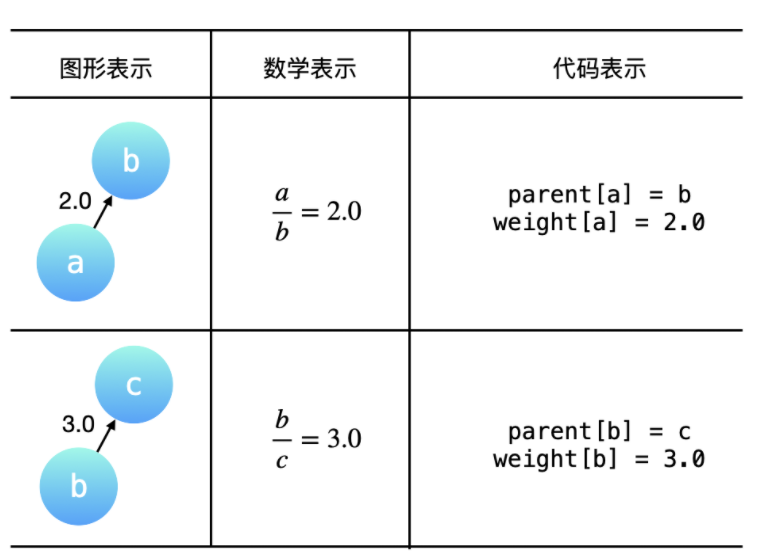
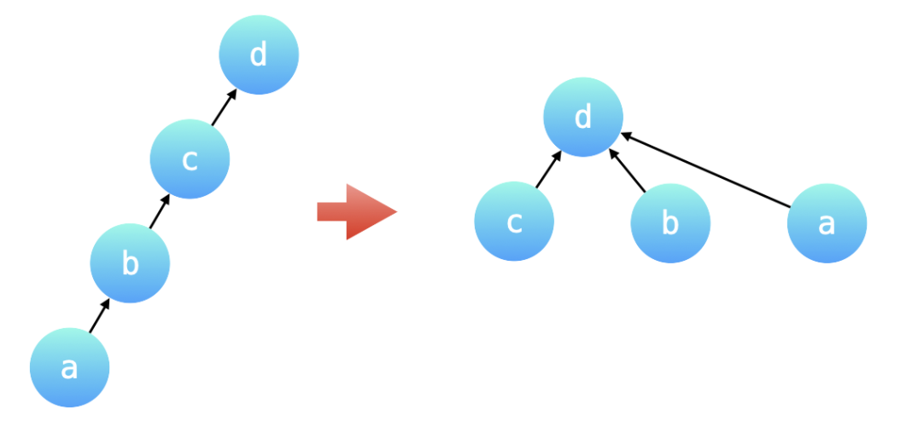
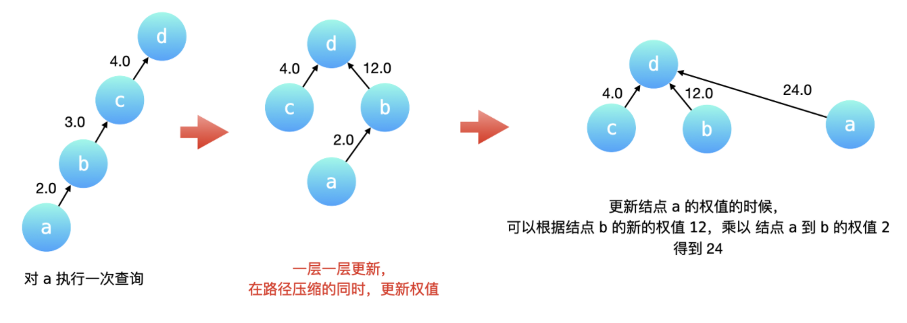
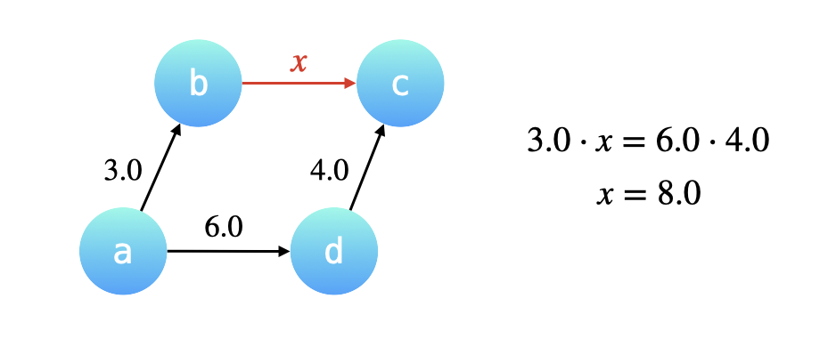

## 399.除法求值

这道题要在第990题：[等式方程的可满足性](../Code/990.等式方程的可满足性.cpp)的基础上，在变量和变量间有了倍数关系。由于倍数关系有传递性，处理有传递性关系的问题，可以用并查集。这里需要在并查集的合并和查询操作中维护这些变量之间的倍数关系。

> 注意：每个`Ai`，`Bi`是一个表示单个变量的字符串，因此`equation = ["ab", "cd"]`中`ab`和`cd`都是一个变量，而不是表示a*b。

### 方法：并查集

可以将题目给出的equation中的两个变量所在的集合进行合并，同在一个集合中的两个变量就可以通过某种方式计算出它们的比值。具体来说，可以把不同变量的比值转换成为相同的变量的比值，这样在做除法时就可以消去相同的变量。然后再计算转换成相同变量以后的系数的比值，就是题目要求的结果。

#### 构建有向图

题目给出的equations和values可以表示成一个图，equations中的变量是图的顶点，values是对应的有向边的权值。

#### 统一变量和路径压缩的关系

为了避免并查集表示的树形结构高度过高，影响查询性能。路径压缩就是针对树的高度的优化。路径压缩的效果是：在查询每一个节点a的根节点的同时，把节点a到根节点的沿途所有节点的父节点都指向根节点。如下图所示，除了根节点之外，所有节点的父亲节点都指向了根节点。因此，可以认为根节点的父节点就是根节点自己。如下图所示：路径压缩前后，并查集表示的两棵树形结构等价，路径压缩后的树的高度为2，查询性能最好。

由于有路径压缩的优化，两个同在一个连通分量中的不同的变量，它们分别到根节点(父节点)的权值的比值，就是题目要求结果。

#### 如何在查询操作的路径压缩优化中维护权值变化

如下图所示，在节点a执行一次查询操作，路径压缩会先一层层向上找到根节点d，然后依次把c、b、a的父节点指向根节点d。

- c的父节点已经是根节点，权值不必改动。
- b的父节点要改为根节点，它的权值就是从当前节点到根节点经过的所有有向边权值的乘积，也就是12.0。
- a的父节点要改成根节点，由于b到c，c到d这两条有向边的权值乘积已知，a到根节点的权值就等于b到根节点d的权值乘以a到b的原来有向边的权值。

#### 如何在合并操作中维护权值的变化

合并操作基于这样一个很重要的前提：**我们将要合并的两棵树的高度最多为2，换句话说两棵树都必须是路径压缩以后的效果**，两棵树的叶子节点到根节点最多只需要经过一条有向边。

例如已知$\dfrac{a}{b} = 3.0$，$\dfrac{d}{c}=4.0$，有已知$\dfrac{a}{d}=6.0$，现在合并节点a和d所在的集合，其实就是把a的根节点b指向d的根节点c，也就是要计算b指向c的有向边的权重：

根据a经过b可以到达c，a经过d也可以到达c，因此两条路径上的有向边的权值的乘积是一定相等的。设b到c的权值为$x$，那么$3.0\cdot x=6.0\cdot 4.0$，得$x = 8.0$。

